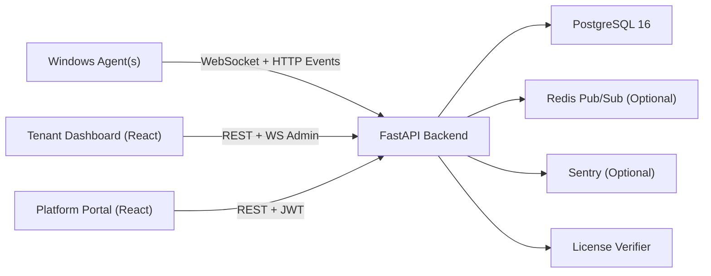
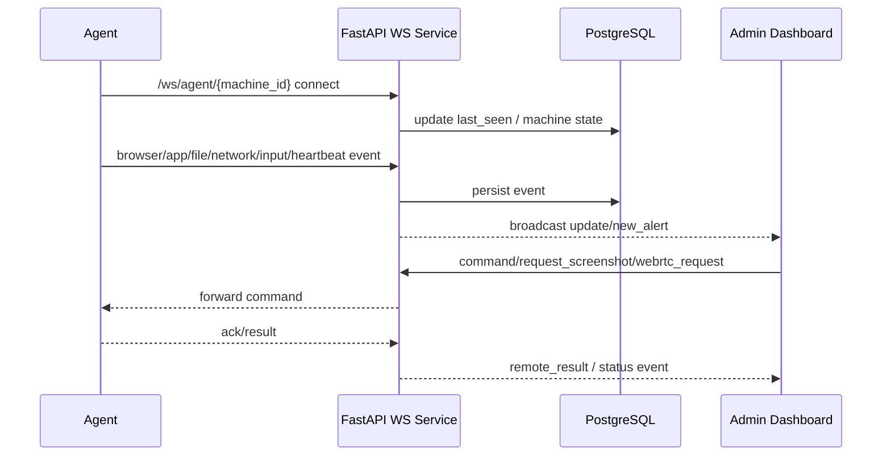

# CropSentinel Master Technical Documentation

Version: 2026-04-25  
Product: CropSentinel (internal compatibility prefix: `CropPro`)

---

## 1. Executive Summary

CropSentinel is a multi-tenant enterprise workforce monitoring and security platform.  
It provides:

- Real-time endpoint visibility (apps, browser, files, network, screenshots, input activity)
- Security analytics (DLP, alerts, audit logs)
- Remote operations (live view, WebRTC remote access, remote commands)
- Tenant-aware operations (tenant isolation, per-tenant users/settings/data, platform admin)
- Team analytics (team creation, machine assignment, individual + aggregated productivity)

Core backend is FastAPI + PostgreSQL with JWT auth, RBAC, auditability, and optional Redis horizontal fan-out.  
Frontend is React + Vite with route-level code splitting and WebSocket live updates.  
Agent is Python-based and sends telemetry continuously with offline queue support.

---

## 2. High-Level Architecture

### Layered design

- Presentation layer:
  - Tenant UI (`/login`, `/dashboard`, `/machines`, `/teams`, etc.)
  - Platform UI (`/platform/login`, `/platform/tenants`, `/platform/users`)
- API layer:
  - Routers under `backend/app/routers/*`
  - Auth, tenant context middleware, RBAC checks in `backend/app/core.py`
- Data layer:
  - DB facade `backend/database.py`
  - Split mixins under `backend/app/db/*`
  - Repository layer under `backend/app/repos/*`
- Agent layer:
  - Telemetry collectors + DLP engine + network/file/input trackers
- Ops/observability:
  - Sentry monitoring (`backend/app/monitoring.py`)
  - CI + tests (`.github/workflows/test.yml`, `backend/tests/*`)

---

## 3. Codebase Structure

### Backend

- Entry:
  - `backend/main.py` (FastAPI app, middleware, router registration)
- Core:
  - `backend/app/core.py` (JWT, RBAC, tenant middleware, rate limit, agent auth)
  - `backend/app/lifecycle.py` (startup initialization, seed defaults, license/seat enforcement)
  - `backend/app/monitoring.py` (Sentry init + payload scrubbing)
  - `backend/app/ws_service.py` (agent/admin WS connections, real-time event routing)
  - `backend/redis_bus.py` (cross-instance pub/sub)
- DB:
  - `backend/database.py` (single DB facade)
  - Mixins in `backend/app/db/`:
    - `tenant_methods.py`
    - `machine_methods.py`
    - `analytics_methods.py`
    - `alert_methods.py`
    - `settings_user_audit_methods.py`
    - `file_network_dlp_methods.py`
    - `team_methods.py`
    - `schema.py`
- Routers:
  - `auth.py`, `analytics.py`, `machines_activity.py`, `data_logs.py`, `settings_alerts.py`, `users.py`, `tenants.py`, `platform.py`, `teams.py`, `websockets.py`
- Services / repos:
  - `backend/app/services/*`
  - `backend/app/repos/*`

### Frontend

- Entry:
  - `frontend/src/main.jsx` (route setup, lazy loading, Sentry init)
- App shell + nav:
  - `frontend/src/App.jsx`
- Auth/API/ws hooks:
  - `frontend/src/hooks/useAuth.jsx`
- Pages:
  - Dashboard, Machines, MachineDetail, MachineProductivity, Teams, TeamDashboard, LiveView, AppUsage, BrowserLogs, Productivity, InputActivity, FileLogs, NetworkLogs, DLPEvents, Alerts, RemoteAccess, Reports, Settings, UserManagement
  - PlatformDashboard, TenantManagement, PlatformUsers

### Agent

- Main runtime:
  - `agent/agent.py`
- Supporting modules:
  - `offline_queue.py`, `file_tracker.py`, `network_tracker.py`, `input_tracker.py`
  - `dlp_engine.py`, `dlp_scoring.py`, `dlp_fingerprint.py`, `dlp_destination.py`
  - `usb_tracker.py`, `print_tracker.py`
  - Windows WebRTC remote-control, file transfer, and watchdog/supervisor responsibilities now live under `agent/native/`

---

## 4. Feature Inventory (Comprehensive)

### 4.1 Authentication & Access

- Username/password login with JWT issuance
- JWT validation + expiration checks
- Login failure tracking + lockout window controls
- Role-based permission gates (`require_permission`)
- Platform-admin-only routes (`require_platform_admin`)
- Machine-level access filtering for non-admin users

### 4.2 Tenant Management (MSP / Platform)

- Tenant CRUD
- Enrollment token rotate
- Tenant-level license/subscription metadata
- Agent bundle download per tenant
- Tenant status guard (active/suspended)
- Default tenant seed and migration-safe behavior

### 4.3 Team Management

- Team CRUD
- Team-machine membership management
- Team machine listing with pagination/search/status filters
- Team productivity aggregate endpoint
- Individual machine productivity endpoint under machine route

### 4.4 Endpoint Monitoring

- Machine registration and heartbeat
- Browser activity ingestion and analysis
- Application activity ingestion and analysis
- Screenshot ingestion and quota enforcement
- Input activity ingestion
- Batch event ingestion (with per-item ack/failure handling)

### 4.5 Security Monitoring

- DLP event ingestion
- DLP policy read/update
- Risk-based alert auto-creation for DLP events
- Alert rule CRUD + toggle
- Alert logs, acknowledgements, purge acknowledged
- File vault for deleted-file backups (admin workflows)
- Network activity ingestion/stats/queries

### 4.6 Analytics & Reporting

- Overview analytics
- Per-machine analytics
- Browser history / app usage / input history APIs
- Productivity score APIs (legacy analytics path + new team/machine productivity routes)
- PDF report generation

### 4.7 Real-Time & Remote

- Admin and agent WebSocket channels
- Online/offline/unstable machine real-time signals
- Remote command dispatch
- WebRTC signaling relay
- Optional Redis-backed fan-out for multi-instance backends

### 4.8 Platform Operations

- License info and upload APIs
- Startup seeding: admin user, defaults, alert rules
- Audit logging for sensitive actions
- Sentry integration with tenant/role/endpoint context tags

---

## 5. Database Design

Current schema tables (from `backend/app/db/schema.py`):

1. `tenants`
2. `machines`
3. `teams`
4. `team_memberships`
5. `browser_activity`
6. `app_activity`
7. `screenshots`
8. `settings`
9. `alert_rules`
10. `alert_logs`
11. `input_activity`
12. `users`
13. `audit_logs`
14. `file_activity`
15. `deleted_file_backups`
16. `network_activity`
17. `dlp_events`

### Tenant isolation model

- Tenant-scoped tables include `tenant_id` FK to `tenants`.
- DB methods use tenant context (`get_tenant_id()`) and tenant-aware filters.
- Middleware resolves tenant from JWT / agent enrollment context.
- Cross-tenant access is blocked by query filtering and permission checks.

### Team data model

- `teams`: UUID primary key, tenant-bound, name/description
- `team_memberships`: team-machine relation, unique `(team_id, machine_id)`

---

## 6. API Catalog (Current Routers)

All endpoints discovered from active router decorators:

### Auth

- `POST /api/auth/login`
- `GET /api/auth/me`
- `GET /api/my-tenant/license`
- `POST /api/auth/change-password`
- `POST /api/auth/verify-agent-password`
- `POST /api/platform/login`

### Machines & Activity

- `GET /api/machines`
- `GET /api/machines/{machine_id}`
- `PUT /api/machines/{machine_id}`
- `DELETE /api/machines/{machine_id}`
- `DELETE /api/machines/{machine_id}/activity`
- `POST /api/machines/register`
- `POST /api/activity/browser`
- `POST /api/activity/application`
- `POST /api/activity/screenshot`
- `POST /api/activity/heartbeat`
- `POST /api/activity/input`
- `POST /api/activity/batch`
- `POST /api/activity/file`
- `POST /api/activity/network`

### Analytics / Productivity / Reports / License

- `GET /api/analytics/overview`
- `GET /api/analytics/machine/{machine_id}`
- `GET /api/analytics/browser/{machine_id}`
- `GET /api/analytics/applications/{machine_id}`
- `GET /api/analytics/productivity/{machine_id}`
- `GET /api/analytics/productivity-logs`
- `GET /api/analytics/input/{machine_id}`
- `GET /api/screenshots/{machine_id}`
- `GET /api/screenshots/latest/{machine_id}`
- `GET /api/reports/generate/{machine_id}`
- `GET /api/license/info`
- `POST /api/license/upload`

### Files / Network / DLP

- `GET /api/files`
- `GET /api/files/stats`
- `GET /api/files/vault`
- `GET /api/files/vault/{backup_id}`
- `DELETE /api/files/vault/{backup_id}`
- `GET /api/network`
- `GET /api/network/stats`
- `POST /api/dlp/events`
- `GET /api/dlp/events`
- `GET /api/dlp/stats`
- `PUT /api/dlp/events/{event_id}/acknowledge`
- `GET /api/dlp/policy`
- `PUT /api/dlp/policy`

### Alerts / Settings / Audit / Remote

- `GET /api/settings`
- `PUT /api/settings`
- `GET /api/settings/ice-servers`
- `GET /api/alerts/rules`
- `POST /api/alerts/rules`
- `PUT /api/alerts/rules/{rule_id}`
- `PATCH /api/alerts/rules/{rule_id}/toggle`
- `DELETE /api/alerts/rules/{rule_id}`
- `GET /api/alerts/logs`
- `GET /api/alerts/stats`
- `POST /api/alerts/logs/{log_id}/acknowledge`
- `POST /api/alerts/logs/acknowledge-all`
- `DELETE /api/alerts/logs/{log_id}`
- `DELETE /api/alerts/logs/acknowledged/purge`
- `GET /api/audit-logs`
- `GET /api/audit-logs/stats`
- `GET /api/audit-logs/actions`
- `GET /api/audit-logs/export`
- `POST /api/remote/command`

### Users

- `GET /api/users`
- `POST /api/users`
- `GET /api/users/{user_id}`
- `PUT /api/users/{user_id}`
- `DELETE /api/users/{user_id}`

### Platform / Tenants

- `GET /api/platform/stats`
- `GET /api/platform/users`
- `POST /api/platform/users`
- `DELETE /api/platform/users/{user_id}`
- `GET /api/tenants`
- `GET /api/tenants/{tenant_id}`
- `POST /api/tenants`
- `POST /api/tenants/{tenant_id}/rotate-token`
- `POST /api/tenants/{tenant_id}/download-agent`
- `PUT /api/tenants/{tenant_id}`
- `DELETE /api/tenants/{tenant_id}`

### Teams

- `POST /api/teams`
- `GET /api/teams`
- `PUT /api/teams/{team_id}`
- `DELETE /api/teams/{team_id}`
- `POST /api/teams/{team_id}/machines`
- `GET /api/teams/{team_id}/machines`
- `DELETE /api/teams/{team_id}/machines/{machine_id}`
- `GET /api/machines/{machine_id}/productivity`
- `GET /api/teams/{team_id}/productivity`

### WebSocket

- `/ws/agent/{machine_id}`
- `/ws/admin`

---

## 7. Security Controls

### 7.1 Authentication and session security

- JWT (`HS256`) for authenticated APIs
- Token expiry handling (`401` on expired/invalid)
- Login lockout:
  - `LOGIN_FAIL_THRESHOLD`
  - `LOGIN_FAIL_WINDOW`
  - `LOGIN_LOCKOUT_SECONDS`

### 7.2 Authorization

RBAC roles:

- `admin`
- `manager`
- `viewer`
- `remote_operator`

Permissions (current set):

- `machines.view`, `machines.edit`, `machines.delete`
- `teams.view`, `teams.manage`
- `activity.view`, `screenshots.view`
- `analytics.view`, `productivity.view`
- `alerts.view`, `alerts.manage`
- `remote.access`
- `reports.generate`
- `settings.view`, `settings.edit`
- `users.view`, `users.manage`

### 7.3 Tenant isolation

- Tenant context is attached per request in middleware
- DB methods query within tenant-scoped context
- Agent enrollment token maps machine registration to correct tenant
- Platform admin checks require tenant `1` and role `admin`

### 7.4 Agent trust boundary

- Optional `AGENT_API_KEY` required on ingestion endpoints
- Agent WS key verification
- Machine/tenant mismatch checks during registration and WS connect

### 7.5 Sensitive data controls

- Sentry scrubbing:
  - passwords, auth headers, JWTs, license keys, TURN passwords, secrets
- Input telemetry privacy:
  - n-gram hashes and event counts (no raw keystroke text)

### 7.6 Auditability

- `audit_log()` records actor, action, resource, source IP, metadata
- Critical admin/platform actions are logged

### 7.7 Abuse and reliability controls

- Rate limiting via SlowAPI limiter (e.g., register endpoint limit)
- Offline grace window for machine disconnect flapping
- Screenshot quota GC to cap storage growth

---

## 8. Productivity Architecture

### Machine productivity (`team_methods.py`)

Inputs:

- App activity durations
- Input activity buckets (active vs idle windows)
- Browser domain usage by productive/unproductive domain lists
- Settings-derived productive app/domain configuration

Outputs:

- `active_time_seconds`, `idle_time_seconds`
- `top_apps`
- `productivity_score` normalized 0–100
- productive and unproductive breakdown
- timeline summary

### Team productivity

Aggregates over team memberships:

- `total_machines`, `active_machines`
- average productivity
- total active time
- alert count
- top aggregated app usage
- low-productivity machines list
- daily trends

---

## 9. Frontend Feature Map

### Tenant dashboard pages

- `/dashboard`
- `/machines`
- `/machines/:machineId`
- `/machines/:machineId/productivity`
- `/teams`
- `/teams/:teamId`
- `/live`
- `/apps`
- `/browser`
- `/productivity`
- `/input`
- `/files`
- `/network`
- `/dlp`
- `/alerts`
- `/remote`
- `/reports`
- `/settings`
- `/users`

### Platform pages

- `/platform/login`
- `/platform` (dashboard)
- `/platform/tenants`
- `/platform/users`
- `/platform/license`

### UI architecture notes

- Lazy-loaded routes (code splitting)
- Shared auth context + shared WS provider
- Notification provider and toasts
- Sentry client integration with payload scrubber

---

## 10. Real-Time Event Flow

---

## 11. License & Feature Gating

- License loaded at startup (`lifespan`)
- Optional strict enforcement (`CROPPRO_LICENSE_ENFORCE`)
- Seat enforcer tracks allowed registrations
- `require_feature(...)` guards feature-restricted endpoints
- Remote access flow validates license feature before creating WebRTC session

---

## 12. Monitoring, Testing, and CI

### Monitoring

- Backend Sentry integration:
  - `SENTRY_DSN`
  - `SENTRY_ENVIRONMENT`
  - `SENTRY_RELEASE`
  - `SENTRY_TRACES_SAMPLE_RATE`
- Context tags:
  - `tenant_id`, `user_role`, `endpoint`, `username`

### Backend tests

Current suite files:

- `test_auth.py`
- `test_permissions.py`
- `test_tenant_isolation.py`
- `test_agent_ingestion.py`
- `test_machines_crud.py`
- `test_alerts.py`
- `test_dlp.py`
- `test_reports_license.py`
- `test_monitoring.py`
- `test_passwords.py`
- `test_smoke.py`

### CI pipeline (`.github/workflows/test.yml`)

- Triggers on push + PR
- Python matrix: 3.11 and 3.12
- Postgres service container
- Coverage threshold: `--cov-fail-under=60`
- Coverage artifact upload + optional Codecov upload

---

## 13. Technology Stack and APIs Used

### Backend libraries

- `fastapi`, `uvicorn[standard]`
- `python-multipart`
- `pydantic`
- `PyJWT`
- `bcrypt`
- `psycopg2-binary`
- `slowapi`
- `redis[asyncio]`
- `sentry-sdk[fastapi]`
- `reportlab`
- `aiortc`
- `cryptography`
- `websockets`

### Frontend libraries

- `react`, `react-dom`
- `react-router-dom`
- `recharts`
- `i18next`, `react-i18next`
- `@sentry/react`
- `vite`

### Protocol/API usage

- REST (JSON) for CRUD/query/reporting
- WebSocket for live updates and command/control
- WebRTC signaling via backend relay for remote media/control
- PostgreSQL SQL queries via psycopg2
- Optional Redis pub/sub for horizontal scaling

---

## 14. Scalability & Performance Notes

- Connection pooling via psycopg2 ThreadedConnectionPool
- Pagination in machine/team/file/network and other list endpoints
- DB indexes on high-cardinality and timestamp-heavy columns
- Redis fan-out support for multi-instance WS distribution
- Route-level code splitting to reduce frontend initial bundle cost

Potential next improvements:

- Precomputed/materialized aggregates for large tenant analytics
- Background jobs for heavy report generation
- Async task queue for long-running operations
- Partition strategy for high-volume activity tables

---

## 15. Deployment and Environment

### Runtime dependencies

- Python 3.10+
- Node.js 18+
- PostgreSQL 16+
- Optional Redis

### Configuration highlights

- Security/auth:
  - `SECRET_KEY`, `AGENT_API_KEY`, CORS controls
- DB:
  - `DATABASE_URL`
- Monitoring:
  - `SENTRY_*`
- Licensing:
  - `CROPPRO_LICENSE_ENFORCE`
- Agent behavior:
  - Screenshot/sync intervals and tracking toggles via settings

---

## 16. Current Risk Areas / Gaps (Engineering View)

1. Table growth management:
   - Activity tables can grow quickly; retention policy automation should be formalized.
2. Large-tenant query cost:
   - Some analytics/team productivity operations can become expensive at high machine counts.
3. End-to-end test expansion:
   - Backend tests are strong; frontend E2E is available but should be expanded for critical flows.
4. Security hardening:
   - Enforce non-default secrets in all non-dev environments.
5. Operational runbooks:
   - Sentry triage exists; incident playbooks can be expanded further.

---

## 17. Recommended Documentation Set

For enterprise delivery, keep these docs as a bundle:

- This file: `docs/CropSentinel_Master_Technical_Documentation.md`
- Team module deep dive: `docs/team-monitoring.md`
- Monitoring runbook: `docs/monitoring.md`
- Product overview / quick start: `README.md`

---

## 18. Ownership and Update Process

- Primary owners: Backend + Platform engineering
- Update trigger:
  - New router/API added
  - Permission model changed
  - Schema migration introduced
  - Monitoring/security control changed
- Suggested cadence:
  - Update this document in same PR as architectural change
