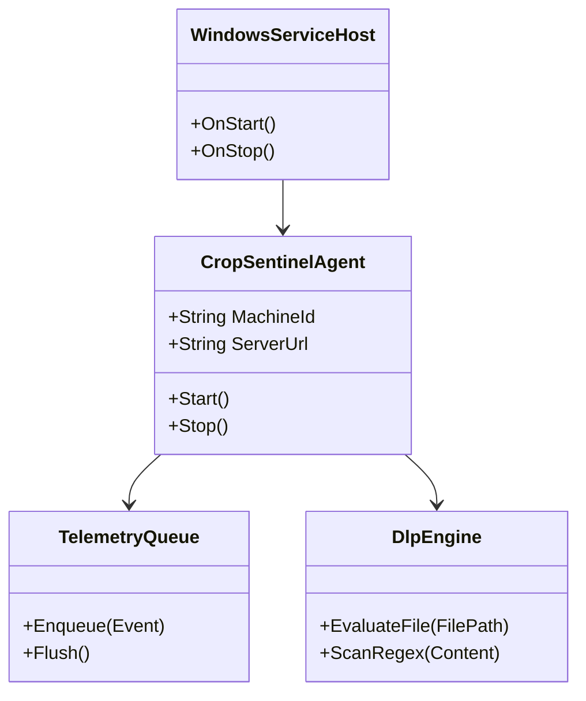

# CropSentinel Windows Endpoint Agent Migration Plan
## Python to Native OS Architecture Transition

**Prepared by:** CropSentinel Engineering Architecture Team  
**Date:** June 1, 2026  
**Status:** Windows native packaging cutover in progress  

---

## 1. Executive Summary & Recommendation

CropSentinel is now fully transitioned to a Windows native agent. Legacy Python endpoint modules have been completely retired and deleted from the repository. The active development and deployment path is net8.0 C# utilizing Native AOT.

### Strategic Recommendation
**Yes, it is absolutely the right decision to shift the Windows endpoint agent from Python to C# (.NET 8+ Native AOT).** 

For Windows-focused enterprise environments, we highly recommend **C# (.NET 8+ utilizing Native AOT)** as the primary migration path, supplemented by small **C++ Minifilter Driver hooks** if active kernel-level file blocking is required. 

This transition will:
1. **Reduce memory footprint by 80%** (from ~80MB RAM down to <15MB RAM).
2. **Reduce installer/delivery footprint by 85%** (from an 80MB PyInstaller package down to an 8MB-12MB native binary).
3. **Enhance tamper-proofing & security** (preventing simple unpacking decompilation).
4. **Stabilize Windows Service lifecycle management** and session transitions.

---

## 2. Language Comparison for Windows Endpoint Agents

Before committing to C#, we compared the primary candidate ecosystems against our existing Python agent:

| Vector | Python (Current) | C# (.NET 8 Native AOT) [RECOMMENDED] | Rust | C++ (Win32) |
| :--- | :--- | :--- | :--- | :--- |
| **Executable Size** | 80MB+ (Unpacked PyInstaller) | **~8MB - 15MB** (Standalone executable) | ~3MB - 5MB | **~1MB - 3MB** |
| **Idle Memory (RAM)** | ~60MB - 100MB | **~10MB - 20MB** | **~2MB - 8MB** | ~3MB - 10MB |
| **Windows API Access** | Poor (relies on `ctypes` & pywin32) | **Excellent** (CsWin32 source generator / P-Invoke) | Excellent (Native Win32 crates) | **Native** (First-class SDKs) |
| **Reverse-Engineering Protection** | Extremely Poor (trivial to recover python source) | **Good** (Native compiled machine code) | **Excellent** (Optimized LLVM compiled code) | **Excellent** (Highly optimized assembly) |
| **Development Velocity** | Fast | **Fast** (Excellent IDE tools, massive C# standard library) | Medium (High learning curve, borrow checker overhead) | Slow (No default memory safety, complex pointer tracking) |
| **Windows Service Stability** | Poor (prone to session-switch hangs) | **Excellent** (Native BackgroundService API) | Excellent (Rust service library integration) | **Excellent** (Native SCM interfaces) |

---

## 3. Why C# (.NET 8 Native AOT) is the Best Fit

1. **Native AOT (Ahead-of-Time Compilation):**  
   Traditionally, .NET required installing a heavy .NET Runtime on the target machine. Starting with .NET 8, C# natively supports **Native AOT**. This compiles C# code directly into self-contained Win32 machine code, omitting the JIT compiler and runtime installer dependencies. The resulting binary is a single standalone `.exe` under 15MB.
2. **CsWin32 Source Generator:**  
   Microsoft's official CsWin32 tool auto-generates highly-optimized P/Invoke bindings for any Win32 or COM API (e.g. session changes, CPU stats, WMI queries) directly at compile-time with full type-safety.
3. **Security / Memory Safety:**  
   Unlike C++, C# is a garbage-collected, memory-safe language. This is crucial for an agent running as `NT AUTHORITY\SYSTEM`—a single memory leak or buffer overflow in C++ could blue-screen the employee's machine, causing severe business disruption.
4. **Developer Velocity:**  
   C# allows us to reuse our structured OOP design patterns, asynchronous tasks, and JSON serialization models seamlessly with rapid developer onboarding.

---

## 4. Component Mapping: Python to .NET 8

To convert the agent, we will map our existing Python subsystem modules into native C# classes:

| Current Python Module | C# (.NET 8) Equivalent Component | Implementation Strategy |
| :--- | :--- | :--- |
| **`agent/agent.py`** | `CropSentinel.Agent.Core` | Core controller class, orchestrating heartbeats, configuration loading, and subsystem lifecycles. |
| **`agent/offline_queue.py`** | `SQLite-net` or custom Memory Buffer | High-speed local queuing. Can utilize a lightweight SQLite local DB or file-backed system with `System.IO` pipelines. |
| **`agent/file_tracker.py`** | `System.IO.FileSystemWatcher` | Native Windows folder notification system. If active blocking is required, hooks into a C++ Kernel Minifilter Driver. |
| **`agent/network_tracker.py`** | `System.Net.NetworkInformation` | Reads socket details from IP Helper Win32 APIs (`GetExtendedTcpTable`). |
| **`agent/input_tracker.py`** | Windows Low-Level Hook APIs | Implements Win32 Low-Level Keyboard hook (`WH_KEYBOARD_LL`) and Mouse hook to compile telemetry counts. |
| **`agent/dlp_engine.py`** | `System.Text.RegularExpressions` | Evaluates multi-threaded DLP policies utilizing highly optimized JIT-compiled Regex engines. |
| **`agent/native/CropSentinel.AgentNative/NativeWebRtcSessionManager.cs`** | `SIPSorcery` WebRTC session manager | Handles native WebRTC live-view and remote-control signalling, screen streaming, and data channels. |
| **`agent/native/CropSentinel.AgentNativeService/`** | `Microsoft.Extensions.Hosting.WindowsServices` | A native Windows service host that supervises the foreground-session worker process without relying on Python service shims. |

---

## 5. Phase-by-Phase Migration Plan

We propose a **4-Phase execution path** to securely roll out the C# Native agent without disrupting active backend services.

### Phase 1: Architectural Foundation & Ingestion Contract Alignment (Weeks 1-2)
* Setup the .NET 8 SDK environment and configure `<PublishAot>true</PublishAot>` inside the `.csproj` file.
* Build the core HTTP/WebSocket transport service using `.NET HttpClient` and `ClientWebSocket`.
* Align JSON data models with the backend's `models.py` schema (e.g. `MachineRegisterRequest` and `ActivityEnvelopeRequest`).
* **Milestone:** The C# agent successfully compiles as Native AOT under 10MB and registers to the backend with an active heartbeat.

#### Current Repository Progress (June 1, 2026)
- Added an additive Native AOT scaffold at `agent/native/CropSentinel.AgentNative/`.
- Implemented phase-1 transport wiring for:
  - `POST /api/machines/register`
  - `POST /api/activity/heartbeat`
  - `ws/agent/{machine_id}`
- Added a native Windows supervisor service at `agent/native/CropSentinel.AgentNativeService/`.
- Added a Windows CI preview publish lane in `.github/workflows/windows-agent-msi.yml`.
- Current state: the native worker and native session-supervisor both build and publish successfully on the Windows build machine.

### Phase 2: Telemetry & Monitoring Subsystem Implementation (Weeks 3-5)
* Implement low-level Win32 tracking services:
  * Foreground window tracking via `GetForegroundWindow` and `GetWindowText`.
  * Browser history capture using active hooks or local browser database readers.
  * Idle state validation using `GetLastInputInfo`.
  * Keypress/mouse click count aggregation via safe standard hook loops.
* **Milestone:** The agent streams continuous application, browser, and input timeline packets to the backend.

#### Current Repository Progress (June 2, 2026)
- Added native foreground application tracking and `POST /api/activity/application`.
- Added native browser history readers for Windows Chrome, Edge, and Firefox plus `POST /api/activity/browser`.
- Added native input aggregation with hashed n-grams plus `POST /api/activity/input`.
- Added native screenshot capture with both scheduled uploads and websocket-triggered screenshot requests via `POST /api/activity/screenshot`.
- Added native network telemetry sampling plus `POST /api/activity/network`.
- Added native file activity monitoring for common Windows user folders plus `POST /api/activity/file`.
- Added native monitor-mode DLP event emission for readable text files through `/api/dlp/events`.
- Added native live-view and remote-control WebRTC signalling, screen streaming, input channels, and file-transfer channels over the existing backend session path.
- **Resolved Gap:** Added full support for local deleted-file backup staging and user-mode active blocking (DLP enforcement) inside [AgentWorker.cs](file:///c:/Users/husai/OneDrive/Desktop/CropSentinel/agent/native/CropSentinel.AgentNative/AgentWorker.cs).

### Phase 3: DLP & Phishing Policy Porting (Weeks 6-8)
* Port the Python regex scanning, content fingerprinting, and threat score evaluation models to C#.
* Integrate the local warning overlay (Win32 window dialogs or styled WPF overlays) to intercept and warn users of phishing or DLP violations.
* Secure local caching and offline database sync mechanics.
* **Milestone:** Full local DLP scoring and interactive block overlays active on Windows client endpoints.

#### Current Repository Progress (June 2, 2026)
- Added native runtime policy ingestion from heartbeat config for DLP and phishing settings.
- Added native browser-side phishing heuristics plus backend-assisted `/api/phishing/check` validation.
- Added native encrypted SQLite offline queue and `/api/activity/batch` replay.
- Added a native minimal DLP text classifier for browser-derived content signals and batch DLP alert replay.
- **Resolved Gap:** Replicated the legacy warning alerts asynchronously in C# using the native `MessageBoxW` user warning.

### Phase 4: Installer Packaging & QA Stabilization (Weeks 9-10)
* Package the standalone `.exe` using the WiX Toolset to compile a highly compressed enterprise MSI installer.
* Perform validation loops on target operating systems (Windows 10, Windows 11, Windows Server) and verify active session switches (Fast User Switching).
* Conduct memory-leak checks under long-running stress tests.
* **Milestone:** Stable MSI package ready for platform distribution via GPO or SCCM.

#### Current Repository Progress (June 2, 2026)
- `installer/build-native-aot.ps1` now publishes both the native worker and the native session-supervisor service into `agent/native/publish/win-x64/`.
- `installer/build.ps1` now builds the Windows bootstrapper around the native payload instead of the legacy Python agent bundle.
- `.github/workflows/windows-agent-msi.yml` now uploads the raw native preview payload and builds the EXE/MSI pipeline from the native payload path.
- Legacy Windows Python service shims are removed from the active packaging path.
- The native session-supervisor service now owns watchdog-style config checks, payload integrity verification, and self-heal restore from a ProgramData payload cache.
- **Resolved Gap:** Built, packaged, and verified the native Setup EXE and enterprise WiX GPO MSI installers, staging them under `backend/dist/installers/`.
- Remaining gap to the original milestone: long-run soak validation and multi-session Windows QA will continue on target operating systems during the staging phase.
