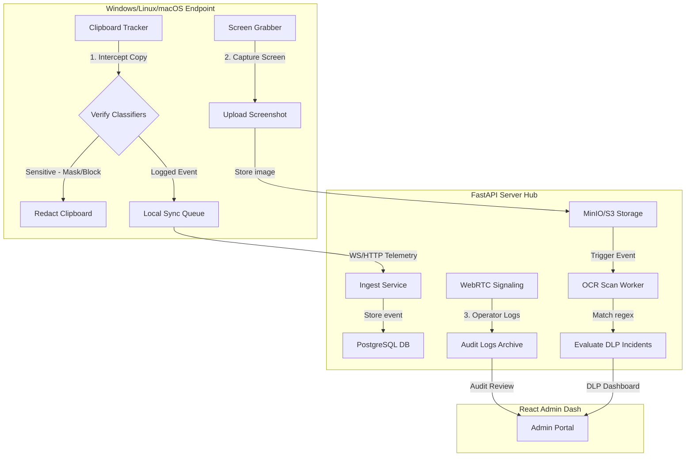

# CropSentinel Future Features Specification
**Version:** 1.0 (Draft)  
**Classification:** Technical Specification & Architectural Specs  
**Role Scope:** Codebase Explorer & System Architect

This detailed document specifies the engineering requirements, data schemas, API contracts, and implementation flows for three next-generation capabilities designed to expand CropSentinel's endpoint security, compliance visibility, and operational integrity.

---

## 1. Architectural Overview & Context

CropSentinel's current multi-tenant design provides a strong foundation for handling ingestion pipelines, real-time command routing, and telemetry storage. These three future features build directly upon existing design patterns:
1. **Clipboard DLP**: Extends the agent's clipboard tracker to intercept copy-paste actions and enforce real-time redaction/masking before data exfiltration occurs.
2. **Screenshot OCR Scanning**: Leverages background workers to scan ingested screenshots for sensitive texts (PII, credentials, payment cards), matching findings against active tenant DLP classifiers.
3. **WebRTC Session Auditing**: Tracks and records remote administration control sessions to a video/metadata timeline for high-security compliance audits.



---

## Feature 1: Clipboard Data Loss Prevention (DLP)

### A. Core Requirements
* **Objective**: Intercept and analyze clipboard payloads on copy/paste operations, restricting the movement of sensitive strings (e.g. Credit Cards, API Keys, Passwords) between secure corporate environments and insecure locations (e.g. ChatGPT, private messaging apps, personal mail).
* **Action Types**: 
  1. `monitor`: Log the action but let it proceed.
  2. `block`: Intercept and clear the system clipboard, showing a silent system warning.
  3. `mask`: Redact the sensitive characters (e.g., `4111-XXXX-XXXX-1111`) before the paste is executed.

### B. Database Schema Changes
Add the following tables to `backend/app/db/schema.py` or modify the system bootstrap configuration:

```sql
-- Represents individual clipboard events captured across the endpoint fleet
CREATE TABLE IF NOT EXISTS clipboard_activity (
    id                 BIGSERIAL   NOT NULL,
    tenant_id          INTEGER     NOT NULL REFERENCES tenants(id) ON DELETE CASCADE,
    machine_id         TEXT        NOT NULL REFERENCES machines(machine_id) ON DELETE CASCADE,
    timestamp          TIMESTAMPTZ DEFAULT NOW(),
    source_process     TEXT        DEFAULT '', -- Process copied from
    target_process     TEXT        DEFAULT '', -- Process pasted into (if captured)
    text_length        INTEGER     NOT NULL,
    md5_hash           TEXT        NOT NULL,   -- Hashed pattern verification
    matched_rules      JSONB       DEFAULT '[]', -- Matched DLP rules
    action_taken       TEXT        DEFAULT 'monitor', -- monitor, block, mask
    masked_payload     TEXT        DEFAULT '', -- Redacted content representation
    PRIMARY KEY (id, timestamp)
) PARTITION BY RANGE (timestamp);

CREATE INDEX IF NOT EXISTS idx_clipboard_tenant_ts ON clipboard_activity(tenant_id, timestamp DESC);
CREATE INDEX IF NOT EXISTS idx_clipboard_machine ON clipboard_activity(machine_id, timestamp DESC);
```

### C. Endpoint Agent Changes (`agent/clipboard_tracker.py`)
Modify the current loop to integrate with the active DLP Policy engine:

```python
import time
import hashlib
import logging
from typing import Optional
from dlp_engine import dlp_engine # Assume integration with agent's local engine

logger = logging.getLogger("cropsentinel.agent")

class ActiveClipboardDlpTracker:
    def __init__(self, callback):
        self.callback = callback
        self.last_text = ""
        self.last_hash = ""
        
    def _read_clipboard(self) -> Optional[str]:
        # Cross-platform clipboard read
        try:
            import pyperclip
            return pyperclip.paste()
        except Exception:
            return None
            
    def _write_clipboard(self, text: str):
        try:
            import pyperclip
            pyperclip.copy(text)
        except Exception as e:
            logger.error(f"Failed to redact clipboard: {e}")

    def scan_clipboard(self):
        current_text = self._read_clipboard()
        if not current_text or current_text == self.last_text:
            return
            
        self.last_text = current_text
        text_hash = hashlib.md5(current_text.encode('utf-8')).hexdigest()
        if text_hash == self.last_hash:
            return
            
        self.last_hash = text_hash
        
        # 1. Evaluate string through local DLP engine classifiers
        findings, matched_rules, action = dlp_engine.evaluate_text(current_text)
        
        if action in ("block", "mask"):
            if action == "block":
                self._write_clipboard("") # Clear clipboard
                logger.warning("Clipboard paste blocked due to sensitive corporate policy violation.")
            elif action == "mask":
                masked_text = dlp_engine.mask_sensitive_text(current_text, findings)
                self._write_clipboard(masked_text)
                self.last_text = masked_text # Update cache to avoid re-triggering
                
        # 2. Package telemetry metadata payload
        event_payload = {
            "type": "clipboard_activity",
            "timestamp": time.time(),
            "text_length": len(current_text),
            "md5_hash": text_hash,
            "matched_rules": matched_rules,
            "action_taken": action,
            "masked_payload": dlp_engine.mask_sensitive_text(current_text, findings) if len(findings) > 0 else ""
        }
        
        self.callback(event_payload)
```

---

## Feature 2: High-Volume Screenshot OCR Scanner

### A. Core Requirements
* **Objective**: Automate character extraction from screenshots uploaded to S3/MinIO. Flag administrative violations in real time when sensitive credentials, licensing keys, or payment data is visible on user monitors.
* **Flow**:
  1. Agent uploads screenshot.
  2. `ingest_screenshot` service triggers a background worker (using FastAPI's `BackgroundTasks` or a Celery/Redis queue).
  3. Worker extracts text using PyTesseract or a designated cloud OCR interface.
  4. Extracted text is checked against active regex classifiers in the tenant’s database.

### B. Database Schema Changes
Extend the `screenshots` table and introduce a `screenshot_ocr_findings` table:

```sql
-- Stores verified text findings detected in visual assets
CREATE TABLE IF NOT EXISTS screenshot_ocr_findings (
    id            BIGSERIAL   PRIMARY KEY,
    tenant_id     INTEGER     NOT NULL REFERENCES tenants(id) ON DELETE CASCADE,
    screenshot_id BIGINT      NOT NULL REFERENCES screenshots(id) ON DELETE CASCADE,
    scanned_at    TIMESTAMPTZ DEFAULT NOW(),
    raw_text_keys TEXT        DEFAULT '',   -- Extracted keyword anchors (space-separated)
    findings      JSONB       DEFAULT '[]',  -- Matched classifiers and risk scores
    risk_level    TEXT        NOT NULL DEFAULT 'low', -- low, medium, high, critical
    incident_ref  BIGINT                     -- Links to dlp_incidents if escalated
);

CREATE INDEX IF NOT EXISTS idx_ocr_screenshot ON screenshot_ocr_findings(screenshot_id);
CREATE INDEX IF NOT EXISTS idx_ocr_tenant_risk ON screenshot_ocr_findings(tenant_id, risk_level);
```

### C. Backend Worker Service (`backend/app/services/ocr_worker.py`)
Implement the OCR analyzer running asynchronously in the backend:

```python
import io
import json
import logging
from PIL import Image
import pytesseract
from database import db, set_tenant_context, clear_tenant_context
from app.db.core import Connection

logger = logging.getLogger("cropsentinel")

class ScreenshotOcrWorker:
    @staticmethod
    def process_screenshot(tenant_id: int, screenshot_id: int, image_bytes: bytes):
        """Asynchronously extract and evaluate text from uploaded screenshots."""
        set_tenant_context(tenant_id)
        try:
            # 1. Load Pillow image and perform OCR extraction
            image = Image.open(io.BytesIO(image_bytes))
            extracted_text = pytesseract.image_to_string(image)
            
            if not extracted_text.strip():
                return  # No characters found
                
            # 2. Query active classifiers configured for this tenant
            classifiers = db.get_active_classifiers(tenant_id)
            findings = []
            highest_risk = "low"
            risk_score = 0
            
            for cls in classifiers:
                # Perform regex matching
                matches = cls.evaluate_regex(extracted_text)
                if matches:
                    findings.append({
                        "classifier_id": cls.id,
                        "name": cls.name,
                        "severity": cls.severity,
                        "matches_count": len(matches)
                    })
                    if cls.severity == "high" or highest_risk == "medium" and cls.severity == "critical":
                        highest_risk = cls.severity
            
            if not findings:
                return  # No sensitive text found
                
            # 3. Store OCR findings
            with Connection() as conn:
                with conn.cursor() as cur:
                    cur.execute(
                        """
                        INSERT INTO screenshot_ocr_findings 
                        (tenant_id, screenshot_id, raw_text_keys, findings, risk_level)
                        VALUES (%s, %s, %s, %s, %s)
                        RETURNING id
                        """,
                        (
                            tenant_id, 
                            screenshot_id, 
                            extracted_text[:1000].replace('\n', ' '), 
                            json.dumps(findings), 
                            highest_risk
                        )
                    )
                    ocr_id = cur.fetchone()["id"]
            
            # 4. Trigger DLP incident escalation if severity is medium or higher
            if highest_risk in ("medium", "high", "critical"):
                db.escalate_ocr_to_dlp_incident(tenant_id, screenshot_id, ocr_id, findings, highest_risk)
                
        except Exception as e:
            logger.error(f"OCR Worker processing failed for screenshot {screenshot_id}: {e}")
        finally:
            clear_tenant_context()
```

---

## Feature 3: WebRTC Remote Session Auditing & Recording

### A. Core Requirements
* **Objective**: Maintain absolute corporate auditability of administrative operations. Every remote access shell or desktop session initiated by an operator must be recorded and cataloged in the Platform Audit logs.
* **Design Strategy**:
  1. Record key-frame changes and system events directly from the WebRTC data channel.
  2. Maintain a frame-accurate playback sequence by archiving screen telemetry frames with system state metadata.

### B. Database Schema Changes
Extend the `audit_logs` model to hold remote session session-record metadata:

```sql
-- Tracks detailed operator event history during WebRTC desktop control
CREATE TABLE IF NOT EXISTS remote_session_audit_records (
    id                  BIGSERIAL   PRIMARY KEY,
    tenant_id           INTEGER     NOT NULL REFERENCES tenants(id) ON DELETE CASCADE,
    session_id          TEXT        NOT NULL UNIQUE, -- WebRTC session UUID
    operator_username   TEXT        NOT NULL,
    machine_id          TEXT        NOT NULL REFERENCES machines(machine_id) ON DELETE CASCADE,
    started_at          TIMESTAMPTZ DEFAULT NOW(),
    ended_at            TIMESTAMPTZ,
    commands_sent       JSONB       DEFAULT '[]',    -- Discrete actions issued
    recording_path      TEXT        DEFAULT '',      -- Path to recorded visual stream
    file_transfer_count INTEGER     DEFAULT 0
);

CREATE INDEX IF NOT EXISTS idx_session_audit_tenant ON remote_session_audit_records(tenant_id, started_at DESC);
```

### C. Signaling Ingestion and Storage (`backend/app/ws_service.py`)
Capture session markers when control streams are opened or closed:

```python
from database import db, set_tenant_context, clear_tenant_context

async def handle_webrtc_session_start(session_id: str, operator_username: str, machine_id: str, tenant_id: int):
    set_tenant_context(tenant_id)
    try:
        db.create_session_audit_entry({
            "session_id": session_id,
            "operator_username": operator_username,
            "machine_id": machine_id,
            "tenant_id": tenant_id
        })
    finally:
        clear_tenant_context()

async def handle_webrtc_session_end(session_id: str, commands_log: list, tenant_id: int):
    set_tenant_context(tenant_id)
    try:
        db.finalize_session_audit_entry(session_id, {
            "ended_at": utcnow(),
            "commands_sent": commands_log
        })
    finally:
        clear_tenant_context()
```

### D. Frontend Operator Warn UI (`frontend/src/pages/RemoteAccess.jsx`)
Strict notice rules mandate that administrators are notified that their sessions are actively recorded:

```jsx
import React from 'react';
import { ShieldCheckIcon, VideoCameraIcon } from '@heroicons/react/24/solid';

export function SessionAuditIndicator({ operatorName, isRecording }) {
  return (
    <div className="flex items-center gap-3 p-3 bg-red-950/40 border border-red-800/60 rounded-lg text-red-200 text-sm animate-pulse">
      <VideoCameraIcon className="w-5 h-5 text-red-500" />
      <div>
        <p className="font-semibold">Security Audit Active</p>
        <p className="text-xs text-red-300">
          This session is recorded for compliance. Operator: <span className="font-mono text-white">{operatorName}</span>.
        </p>
      </div>
      {isRecording && (
        <span className="ml-auto flex h-2 w-2 relative">
          <span className="animate-ping absolute inline-flex h-full w-full rounded-full bg-red-400 opacity-75"></span>
          <span className="relative inline-flex rounded-full h-2 w-2 bg-red-500"></span>
        </span>
      )}
    </div>
  );
}
```

---

## 2. Security, Compliance, & Privacy Strategy

Integrating these features requires a balance between security logging and employee privacy.

1. **Hashing & Redaction first**: Clipboard tracking must only store plaintext matches for verified violations. Non-matching clipboard texts are discarded immediately on the agent, and only lengths and cryptographic MD5 hashes are cataloged to prevent logging standard copy-paste strings.
2. **Access Control Limits**: Access to `deleted_file_backups` and `screenshot_ocr_findings` is governed by a strict RBAC permission set (`activity.view` and `screenshots.view`).
3. **Session Audit Non-Repudiation**: Remote session audit rows in `remote_session_audit_records` are signed with a server-side cryptographic hash on closure, ensuring audit trails cannot be altered or removed by administrators.
